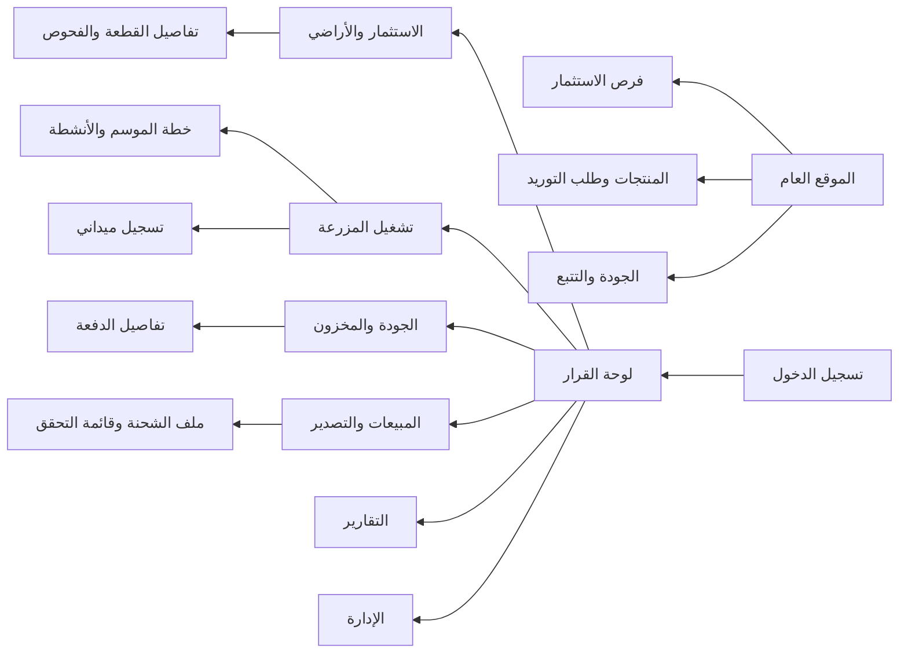

# مواصفات الواجهات والاختبار والإطلاق — النسخة الأولى

## 1. مبادئ تجربة المستخدم

واجهة المشروع عربية أولاً وباتجاه من اليمين إلى اليسار، مع قابلية تشغيل اللغة الإنجليزية لاحقاً للمشترين والموردين الدوليين. تنقسم التجربة إلى واجهة عامة خفيفة تبني الثقة، وبيئة تشغيل محمية تركز على القرار أو تنفيذ المهمة. لا تظهر للمستخدم الميداني قوائم الاستثمار أو المالية، ولا يظهر للمستثمر تعديل بيانات التشغيل.

| المبدأ | تطبيقه في الواجهة |
|---|---|
| قرار قبل رقم | تبدأ لوحات القيادة بما يحتاج إجراءً، مثل دفعة محتجزة أو موسم متجاوز للميزانية، ثم تعرض الأرقام التفسيرية. |
| إدخال ميداني سريع | تسلسل من أربع خطوات كحد أقصى: اختيار الحقل، اختيار النشاط، إدخال الكمية، إرفاق صورة أو ملاحظة. |
| تتبع ظاهر | يظهر رقم الدفعة وحالتها ورابط المصدر في كل صفحة حصاد ومخزون وبيع وتصدير. |
| منع الخطأ قبل وقوعه | تعطل زر الانتقال إلى الشحن عند وجود وثيقة إلزامية مفقودة، مع سبب واضح وزر للانتقال إلى المتطلب. |
| دعم الاتصال الضعيف | تصمم واجهات الحقل لحفظ المسودة محلياً والتنبيه بحالة المزامنة في مرحلة تطبيق الجوال. |

## 2. خريطة التنقل

## 3. Wireframes وصفية للشاشات الأساسية

### 3.1 الموقع العام

| المنطقة | المحتوى | الإجراء الأساسي | حالة البيانات |
|---|---|---|---|
| الشريط العلوي | الشعار، عن المشروع، الاستثمار، المنتجات، الجودة والتتبع، تواصل، اللغة | «اطلب اجتماعاً» و«طلب توريد» | ثابت، متجاوب للهاتف |
| الصفحة الرئيسية | بيان قيمة واضح، مؤشرات معتمدة فقط، خريطة مبسطة للمناطق، نهج الاستدامة | دخول صفحة الاستثمار أو نموذج التوريد | عند غياب أرقام معتمدة، لا تعرض أرقاماً بديلة |
| فرص الاستثمار | بطاقات فرص بحالة «قيد الدراسة/مفتوحة/مغلقة»، نوع الأرض، المنطقة، نموذج الشراكة | طلب مذكرة معلومات | لا تعرض بيانات الأرض الحساسة علناً |
| المنتجات | قائمة منتج/موسم/عبوة/توافر مبدئي وشروط توريد | إرسال طلب B2B | تمييز «غير متاح حالياً» بدلاً من السماح بطلب وهمي |
| الجودة والتتبع | شرح المنهج، مثال بنية رقم الدفعة، شهادات مُتحقق منها فقط | التحقق من رقم دفعة إذا سمحت السياسة | لا تنشر مستندات تتضمن معلومات حساسة |
| تواصل | نموذج منظم: اسم الشركة، نوع الطلب، المنتج، البلد، حجم الطلب، موعد مطلوب | إرسال طلب إلى مسؤول المبيعات | نجاح وإخفاق واضحان مع رقم مرجعي |

### 3.2 لوحة القرار الداخلية

**بنية سطح المكتب:** شريط جانبي ثابت على اليمين يحتوي على الأقسام؛ ترويسة تتضمن اختيار المنظمة أو المزرعة، البحث، التنبيهات، وملف المستخدم. المنطقة الرئيسية تستخدم شبكة 12 عموداً. في الهاتف يتحول الشريط إلى قائمة جانبية، وتتحول البطاقات إلى عمود واحد.

| المنطقة | محتوى سطح المكتب | حالة طبيعية | حالة فارغة | حالة خطأ |
|---|---|---|---|---|
| شريط التنبيه | بطاقات: دفعات محتجزة، فحوص منتهية، نقص مخزون، نشاط متأخر | عدد وحالة وسبب | «لا توجد تنبيهات حرجة» | رسالة استرجاع مع زر إعادة المحاولة |
| ملخص التشغيل | مواسم نشطة، إنتاج مقابل الخطة، ماء لكل طن، تكلفة وحدة مبدئية | مقارنة فترة مختارة | «لا توجد مواسم نشطة» مع زر إنشاء موسم | لا تعرض صفراً مضللاً؛ تظهر حالة تعذر الحساب |
| خريطة المزارع | علامات المزارع والحقول وحالة كل منها | اختيار حقل لفتح التفاصيل | خريطة بدون حقول مع زر إضافة مزرعة | بديل قائم على قائمة المواقع |
| المخزون والجودة | مخزون متاح، محفوظ، محتجز، قريب انتهاء | النقر يفتح قائمة الدفعات | «لا توجد دفعات» | خطأ تحميل مستقل لا يعطل اللوحة كلها |
| جاهزية التصدير | الشحنات وفق المرحلة، متطلبات ناقصة | فتح ملف الشحنة | «لا توجد شحنات» | تنبيه مع تسجيل فني |

### 3.3 واجهة الاستثمار والأراضي

| الشاشة | عناصرها | الإجراءات المسموح بها | معايير القبول |
|---|---|---|---|
| قائمة الفرص | بحث، مرشحات مرحلة/ولاية/نوع حق، درجة ملاءمة، جدول فرص | إنشاء، تعيين مسؤول، نقل مرحلة | لا يمكن اعتماد فرصة بلا فحص ماء وتربة أو توثيق استثناء |
| ملف الفرصة | خريطة، حقائق الموقع، تقييم المخاطر، مستندات، قائمة بوابات القرار | إضافة دليل، طلب مراجعة، اعتماد أو رفض | يظهر سبب القرار والمستخدم والتاريخ في سجل التدقيق |
| المزرعة والقطعة | خريطة، قطع، حقول، مساحات، مصدر الماء، فحوص | إضافة حقل أو اختبار، أرشفة حقل | يمنع إدخال مساحة صفر أو رمز قطعة مكرر |
| تقييم الملاءمة | نموذج معايير: ماء، تربة، لوجستيات، سوق، امتثال | حفظ مسودة، تقديم للمراجعة | يميز بين معلومة موثقة وتقدير خبير |

### 3.4 واجهة تشغيل المزرعة

| الشاشة | بنية العرض | الإجراء الأساسي | التحقق قبل الحفظ |
|---|---|---|---|
| قائمة المواسم | بطاقات الموسم: الحقل، المحصول، الحالة، التقدم، آخر نشاط | فتح الموسم أو إنشاء موسم | لا يبدأ موسم على حقل غير نشط |
| معالج إنشاء موسم | 1) الحقل، 2) المحصول/الصنف، 3) التواريخ والهدف، 4) الميزانية والمراجعة | إنشاء كمسودة ثم اعتماد | تاريخ الحصاد المخطط ليس قبل الزراعة؛ الهدف كمية موجبة |
| تفاصيل الموسم | خط زمني، أنشطة، استهلاك مدخلات، ري، تكلفة، أهداف مقابل فعلية | إضافة نشاط أو طلب اعتماد | يمنع تسجيل نشاط لموسم مغلق |
| تسجيل نشاط ميداني | أزرار أنواع الأنشطة، الحقل، التاريخ والوقت، كمية، مدخلات، صورة/ملاحظة | حفظ مسودة أو إرسال | تحقق من الوحدة والكمية والمخزون للمدخلات |
| سجل الري | حجم الماء، المصدر، الطريقة، مدة التشغيل، ملاحظة | تسجيل ري | لا يقبل حجم ماء سالباً أو مصدراً غير نشط |

### 3.5 واجهة الحصاد والجودة والمخزون

| الشاشة | عناصرها | المسار السليم | حالات حساسة |
|---|---|---|---|
| إنشاء دفعة حصاد | موسم، وقت الحصاد، وزن إجمالي، درجة أولية، عامل | ينشئ `lotCode` وحالة انتظار جودة | الوزن لا يتجاوز مدخلاً إيجابياً؛ الدفعة لا تحرر للبيع تلقائياً |
| تفاصيل الدفعة | مصدر الحقل، سجل الأنشطة، فحوص الجودة، الحجز، المخزون، تاريخ الحركات | إدخال فحص ثم تحرير أو حجز | إذا فشل فحص حرج، تنشأ حالة حجز ويختفي زر التخصيص للبيع |
| المستودع | تبويبات متاح/محجوز/محتجز/مرفوض، بحث برقم الدفعة | تحويل، جرد، إتلاف بسبب | لا يسمح بتحويل كمية أكبر من المتاح |
| التعبئة | مدخل وزن، مخرج معبأ، هدر، شكل العبوة، ارتباط بمخزون | إنشاء دفعة معبأة | تطابق معادلة الوزن ضمن هامش مراجعة محدد |

### 3.6 واجهة المبيعات والتصدير

| الشاشة | عناصرها | الإجراء | بوابة الإطلاق |
|---|---|---|---|
| العملاء | ملف عميل، بلد، بيانات اتصال، حالة، شروط دفع | إنشاء أو حظر عميل | لا يُؤكد طلب لعميل محظور |
| أمر البيع | العميل، بنود، كمية، سعر، مواصفة، نوع الوفاء | تأكيد وتخصيص دفعات | لا تخصص دفعة محتجزة أو منتهية |
| ملف الشحنة | تسلسل الحالة، البنود، الدفعات، الوجهة، الناقل، المستندات | تشغيل فحص الوثائق ثم إعلان الجاهزية | كل متطلب إلزامي «متحقق»؛ أي «مفقود» يمنع الجاهزية |
| قائمة التحقق | متطلبات السوق، المستند المرتبط، الصلاحية، النتيجة، ملاحظات | مراجعة واعتماد | لا يمكن اعتماد مستند منتهي الصلاحية |

## 4. نماذج حالات الواجهة القياسية

| الحالة | الشكل | الرسالة المطلوبة | الإجراء التالي |
|---|---|---|---|
| التحميل | هيكل عظمي للشكل المتوقع، لا شاشة فارغة أو مؤشر شامل فقط | لا نص عند التحميل القصير؛ «جارٍ تجهيز البيانات» عند التأخر | انتظار أو إعادة محاولة تلقائية محدودة |
| عدم وجود بيانات | رسم توضيحي بسيط ونص يشرح السبب | «لم تُنشأ مواسم لهذه المزرعة بعد» | زر صالح للإنشاء لمن يملك الصلاحية |
| منع الصلاحية | بطاقة وصول مقيد مع سبب مختصر | «لا تملك صلاحية تعديل هذه الدفعة» | العودة للقائمة أو طلب صلاحية عبر المدير |
| خطأ إدخال | خطأ ملاصق للحقل مع وصف عملي | «أدخل كمية أكبر من صفر بالكيلوغرام» | الحفاظ على القيم المدخلة |
| خطأ شبكة | تنبيه غير تقني مع رقم مرجعي سجل داخلي | «تعذر حفظ السجل. لم نفقد إدخالك.» | حفظ محلي أو إعادة المحاولة |
| عملية خطرة | نافذة تأكيد توضح الأثر | «سيؤدي الإتلاف إلى خفض المخزون المتاح» | طلب سبب وتأكيد صريح |

## 5. استراتيجية الاختبار وضمان الجودة

لا يُقبل النظام لأنه يعرض صفحات سليمة فقط؛ القبول قائم على صحة معاملات المخزون، وسلامة التتبع، ومنع الشحن غير الممتثل، وفصل الصلاحيات. تُكتب الاختبارات لكل قصة مستخدم حرجة قبل إغلاقها.

| طبقة الاختبار | النطاق | الأداة أو الأسلوب | مالك التنفيذ | معيار النجاح |
|---|---|---|---|---|
| اختبار وحدة | حساب الرصيد، حالات الدفعة، قواعد الوثائق والصلاحيات | Vitest | المطور | نجاح كامل للاختبارات الحرجة دون تخطي |
| اختبار تكامل | إجراء tRPC مع قاعدة بيانات اختبار ومعاملة كاملة | Vitest + قاعدة اختبار | المطور | رفض الحالات غير المسموحة وحفظ الحالة السليمة |
| اختبار واجهة | نماذج الإدخال، التحميل، الفراغ، الخطأ، الاستجابة العربية | فحص يدوي منظم ثم Playwright عند استقرار الواجهة | QA/المطور | جميع معايير قصة المستخدم محققة |
| اختبار قبول تشغيلي UAT | موسم ودفعة ومستودع وطلب وشحنة من بيانات تجريبية واقعية غير حساسة | جلسة مع مدير مزرعة وجودة ومبيعات | صاحب العملية | توقيع قبول لكل مسار |
| اختبار أمان وصلاحيات | عدم وصول مستخدم لحساب أو منظمة أو عملية غير مصرح بها | مراجعة دورية وإجراءات محمية | المطور/مدير النظام | حالات الاختبار السلبية ترفض بـ 403 أو واجهة مقيدة |
| اختبار أداء مبدئي | قائمة حقول ومخزون وسجل أنشطة بأحجام متوقعة | قياس في بيئة المعاينة | المطور | زمن الاستجابة ضمن هدف المنتج المتفق عليه |

### حالات قبول حرجة يجب أتمتتها

| المعرف | السيناريو | النتيجة المتوقعة |
|---|---|---|
| `AC-01` | يسجل المشرف نشاط تسميد بدفعة إدخال متاحة | ينقص المتاح مرة واحدة، ويسجل نشاط واستخدام وسجل تدقيق في معاملة واحدة |
| `AC-02` | يحاول المستخدم استخدام كمية أكبر من رصيد الدفعة | يرفض النظام العملية ولا تتغير الكميات |
| `AC-03` | ينشئ المهندس دفعة حصاد ثم يسجل فحص متبقيات فاشلاً | تنتقل الدفعة إلى حجز ولا يمكن تخصيصها للبيع |
| `AC-04` | يحاول مسؤول غير مخول تحرير دفعة محتجزة | يرفض النظام الطلب ولا تتغير الحالة |
| `AC-05` | ينشئ مسؤول التصدير شحنة مع متطلب وثيقة إلزامي مفقود | تبقى الشحنة في فحص الوثائق ولا تصبح جاهزة للشحن |
| `AC-06` | يربط المسؤول مستنداً منتهي الصلاحية بشحنة | يعرض النظام الحالة منتهية ويمنع الاعتماد |
| `AC-07` | ينشئ مستخدم من منظمة ثانية استعلاماً عن دفعة | لا تظهر الدفعة ولا يمكن الوصول إلى بياناتها |
| `AC-08` | يدخل العامل نشاطاً من هاتف بشاشة صغيرة | تظل الحقول الأساسية قابلة للوصول والحفظ واضحاً |

## 6. بوابات الجودة والإطلاق

| البوابة | ما يراجع | قرار المرور |
|---|---|---|
| G0 — تثبيت النطاق | بطاقة المشروع، المواقع، ثلاثة محاصيل، المستخدمون، السوق | لا يبدأ التصميم التفصيلي قبل موافقة مكتوبة |
| G1 — قبول التصميم | ERD، قاموس البيانات، wireframes، صلاحيات، قصص المستخدم | لا يبدأ التطوير قبل اعتماد مسؤول التشغيل والجودة |
| G2 — قبول التطوير | مراجعة الكود، الترحيلات، اختبارات وحدة وتكامل، الوصول | لا تصل الميزة إلى المعاينة إن فشلت حالة حرجة |
| G3 — قبول UAT | تدفق من موسم إلى دفعة إلى شحنة، حالات خطأ، تدريب المستخدمين | لا ينتقل النظام للتشغيل الفعلي دون توقيع أصحاب العملية |
| G4 — تشغيل تجريبي | بيانات حقيقية محدودة، دعم يومي، تقرير أخطاء وملاحظات | التوسع بعد استقرار دورة تشغيل كاملة |
| G5 — توسع | دقة البيانات، فاقد، التزام وثائق، رضا المستخدم، عائد تشغيلي | إضافة مزارع أو مستشعرات أو أسواق جديدة تدريجياً |

## 7. خطة الإطلاق المرحلي

| الإصدار | يشمل | لا يشمل عمداً | مقياس قرار الترقية |
|---|---|---|---|
| `MVP-0` — إدارة الأرض | الفرص، المزارع، القطع، الحقول، فحوص التربة والماء، المستخدمون | التجارة والتصدير ومستشعرات IoT | اكتمال فحوص المواقع التجريبية وقبول قرار الأرض |
| `MVP-1` — تشغيل الموسم | المواسم، الأنشطة، الري، المدخلات، تكاليف أساسية | تنبؤات الذكاء الاصطناعي والأسعار الآلية | إدخال النشاط خلال 24 ساعة من تنفيذه في غالبية الحالات |
| `MVP-2` — الحصاد والجودة | دفعات الحصاد، الفحص، الحجز، المخزون، التعبئة | التكامل مع المختبرات أو المستشعرات | تتبع دفعة كاملة دون عمل يدوي خارج النظام |
| `MVP-3` — البيع والتصدير | العملاء، الطلبات، الشحن، قائمة الوثائق وتقارير الجاهزية | تقديم حكومي آلي أو تجارة تجزئة كاملة | إكمال ملف شحنة تجريبية بمستندات متحققة |
| `Scale-1` | خرائط متقدمة، مستشعرات، تكامل مختبر، بوابة مشترين أو متجر | توسع وطني دفعة واحدة | نجاح موسمي وتقارير موثوقة وقرار استثمار جديد |

## 8. قائمة التسليم لكل إصدار

كل إصدار يتضمن وثيقة تغيير مختصرة، ترحيلات مراجعة، اختبارات، دليل مستخدم محدّث، ونسخة قاعدة بيانات قابلة للاستعادة. يجب أن يوضح الدليل ما الذي يستطيع المستخدم فعله وما الذي لا يزال خارج النطاق، خاصة في ملفات الامتثال والتصدير حيث لا تعني شاشة «مكتمل» صدور موافقة حكومية أو جمركية.
