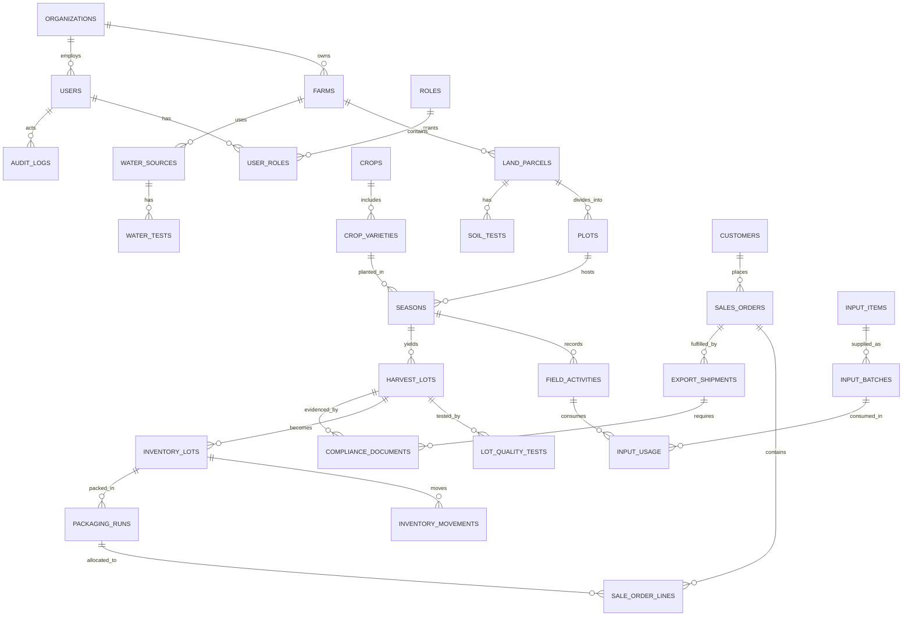

# خارطة طريق منصة الاستثمار الزراعي والأمن الغذائي والتصدير في سلطنة عُمان

**تاريخ الإعداد:** 19 أغسطس 2026  
**إعداد:** Manus AI  
**حالة الوثيقة:** تصور تأسيسي للنسخة الأولى؛ الأرقام المالية وقرارات المحاصيل النهائية معلّقة على نتائج الأرض والمياه والسوق وعقود الشراء.

## 1. القرار الاستراتيجي المقترح

المشروع المقترح ليس موقعاً لبيع المنتجات فحسب، بل **منصة تشغيل واستثمار زراعي متكاملة**. وظيفتها تحويل الأرض الزراعية إلى أصل منتج يمكن قياس أدائه وإدارته، ثم ربط الإنتاج المحلي بالمخزون والفرز والتعبئة والجودة والتعاقدات والتصدير. وبهذا يصبح هدف الاكتفاء الغذائي قابلاً للقياس عبر مؤشرات الإنتاج المحلي، والتغطية الموسمية، والفاقد، وبدائل الواردات؛ بينما تصبح قابلية التصدير مرتبطة بالتتبع والوثائق والجودة لا بمجرد توفر فائض مؤقت.

يدعم هذا الاتجاه سياق استثماري معلن في عُمان: تشير منصة **استثمر في عُمان** إلى أولوية الزراعة المحمية، والتصنيع الغذائي، وإدارة المياه، ومحاصيل مثل البصل والثوم والبطاطس ضمن محاصيل ذات اكتفاء أقل، كما تربط القطاع برؤية عُمان 2040 والأمن الغذائي. وتفيد الصفحة بأن مساهمة الزراعة في الناتج المحلي بلغت 2.31% في 2023، وأن القطاع نما 9.8% في 2024. هذه مؤشرات سياقية وليست بديلاً عن تحليل الجدوى لموقع محدد.[1]

> **صياغة الرؤية:** «بناء محفظة من الأراضي والمزارع القابلة للقياس، تنتج محاصيل ذات أولوية محلية، وتُدار رقمياً من التربة والمياه حتى المشتري أو ميناء التصدير، مع تتبع لكل دفعة وإثبات للالتزام والجودة». 

| طبقة المشروع | ما تحتويه | النتيجة العملية |
|---|---|---|
| الاستثمار والأراضي | فرص الأراضي، الحقوق أو الإيجار، دراسة الموقع، الاستثمار الرأسمالي، الشراكات | اختيار موقع قابل للتشغيل، لا مجرد أرض متاحة |
| التشغيل الزراعي | الحقول، المحاصيل، المواسم، العمال، الري، المدخلات، النشاطات والحصاد | تكلفة وإنتاجية ومخاطر مرئية على مستوى الحقل |
| سلسلة القيمة | الفرز، التعبئة، التخزين، المخزون، الجودة، المشتريات والمبيعات | تقليل الفاقد ورفع انتظام التوريد |
| السوق والتصدير | المشترون، العقود، الأسعار، الشحن، المستندات والشهادات | مبيعات محلية أولاً وتصدير جاهز عند استيفاء المتطلبات |
| المنصة الرقمية | قاعدة بيانات، لوحات مؤشرات، تطبيق تشغيل، سجل تتبع ووثائق | قرار مبني على بيانات وسجل تدقيق قابل للمراجعة |

## 2. ابدأ بالنموذج الصحيح، لا بالتطوير البرمجي

هناك ثلاثة نماذج محتملة، ويُوصى في البداية بالنموذج الأول لأنه يوفّر السيطرة على الجودة والبيانات ويقلل تعقيد المنصة. يمكن إضافة النموذجين الآخرين بعد إثبات نجاح التشغيل في مزرعة أو منطقتين.

| النموذج | الوصف | ملاءمته للنسخة الأولى |
|---|---|---|
| مشغّل ومحفظة أراضٍ | الشركة تستثمر أو تستأجر الأراضي وتدير الإنتاج مباشرة أو عبر مشغلين متعاقدين | **موصى به**؛ يربط قرار الاستثمار بنتيجة تشغيل فعلية |
| مجمّع للمزارعين | الشركة تدير التتبع والجودة والتسويق لمزارعين مستقلين وتجمع محاصيلهم | مرحلة ثانية؛ يتطلب شبكة توريد وثقة وحوكمة بيانات |
| سوق إلكتروني مفتوح | ربط بائعين ومشترين دون سيطرة تشغيلية على المزرعة | مرحلة لاحقة؛ لا يعالج مباشرة مخاطر الإنتاج والجودة |

**نطاق النسخة الأولى (MVP):** يُدار مشروع تجريبي واحد أو اثنان، مع عدد محدود من الأراضي والحقول ومحاصيل مختارة، ويغطي تقييم الأرض، تخطيط الموسم، العمليات، المدخلات، الحصاد، المخزون، الجودة، الدفعات، أوامر البيع، ومستندات التصدير. لا تُبنى منصة مزادات أو تطبيق استشارات بالذكاء الاصطناعي في البداية؛ فالأولوية هي بيانات تشغيلية دقيقة يمكن الوثوق بها.

## 3. دراسة الجدوى: البوابات التي تسبق أي استثمار كبير

دراسة الجدوى ليست فقرة واحدة ولا يمكن اختصارها في «المحصول مربح». هي سلسلة بوابات قرار؛ إذا فشلت الأرض أو المياه أو المشترون أو متطلبات الجودة، فلا ينبغي أن ينتقل المشروع إلى مرحلة الإنشاء حتى لو بدت التوقعات التسويقية جيدة.

| بوابة القرار | السؤال الحاسم | مخرجات مطلوبة قبل المرور للمرحلة التالية | صاحب التحقق |
|---|---|---|---|
| السوق | من سيشتري، بأي مواصفة، وفي أي موسم، وبأي حجم؟ | قائمة مشترين، أسعار تاريخية موثقة، خطابات نوايا أو عقود توريد مبدئية | مدير تجاري وتسويق زراعي |
| الأرض والموقع | هل الموقع مناسب للمحصول والبنية التحتية واللوجستيات؟ | إحداثيات، ملكية/إيجار، فحص تربة، وصول طرق وكهرباء، قرب من التجميع أو الميناء | خبير زراعي وقانوني |
| المياه | هل كمية المياه ونوعيتها وتكلفتها ثابتة ومسموح بها؟ | اختبار مياه، مصدر مرخّص، معدل تدفق، ملوحة، كلفة ضخ/معالجة، خطة طوارئ | مهندس ري وجهة مختصة |
| التقنية | ما أسلوب الإنتاج الأقل مخاطرة والأكثر قابلية للقياس؟ | مقارنة زراعة مكشوفة/محميّة/بدون تربة، تصميم ري، إنتاجية مستهدفة متحفظة | مهندس زراعي |
| التشغيل | من ينفّذ وما هي الطاقة الفعلية للمزرعة؟ | هيكل فريق، رزنامة عمليات، خطة صيانة، مورّدو مدخلات، تدريب وسلامة | مدير مزرعة |
| الجودة والتصدير | هل يمكن تتبع كل دفعة واستيفاء متطلبات السوق المستهدف؟ | مواصفات العميل، بروتوكول فحص، مخطط تعبئة، قائمة وثائق وشحن | مسؤول جودة وتصدير |
| المال | هل المشروع يتحمل تقلب الإنتاج والسعر والمياه؟ | نموذج مالي لخمسة أعوام، سيناريوهات هبوط/أساس/صعود، احتياطي سيولة | محلل مالي ومجلس الاستثمار |

### 3.1 نموذج اختيار المحاصيل

لا تُختار المحاصيل بالطلب العام فقط. تُرتب المرشحات في مصفوفة مرجّحة، ولا تعتمد النتيجة حتى تمر كل مرشحات «الحد الأدنى» المتعلقة بالمياه والتربة والترخيص والمشتري. في السياق العُماني، يمكن إدراج البصل والثوم والبطاطس كمرشحين أوليين لبدائل الواردات لأن منصة Invest Oman تذكرها ضمن محاصيل استراتيجية ذات اكتفاء منخفض؛ أما اختيارها النهائي فيتوقف على المنطقة، المياه، سلاسل التبريد، العائد للمتر المكعب، وعقود الشراء.[1]

| معيار الاختيار | طريقة القياس في دراسة الجدوى | الوزن المقترح |
|---|---|---:|
| ملاءمة التربة والمياه والمناخ | نتائج مختبر + ملاءمة موقع + ملوحة وتوافر المياه | 25% |
| مساهمة الاكتفاء الغذائي | حجم الواردات أو فجوة العرض المحلي وموسمية الطلب | 20% |
| اقتصاديات الوحدة | هامش الكيلوغرام/الصندوق، تكلفة المتر المكعب، فترة الاسترداد | 20% |
| قابلية التصدير | مواصفة المشتري، العمر التخزيني، فحوص المتبقيات، متطلبات السوق | 15% |
| قابلية التخزين أو التصنيع | العمر بعد الحصاد، قابلية الفرز والتعبئة والتحويل الغذائي | 10% |
| جاهزية سلسلة الإمداد | البذور أو الشتلات، العمالة، التعبئة، النقل، قطع الغيار | 10% |

**بنية المحفظة الأفضل في البداية:** مزيج متوازن من محاصيل بديلة للواردات ذات دورة واضحة، ومحاصيل ذات قيمة وقابلية للتعبئة، ومنتج قابل للتخزين أو التصنيع. لا ينبغي وضع كامل رأس المال في محصول واحد أو في سوق تصدير واحد. الإنتاج للتصدير يبدأ بعقد شراء ومواصفة موقعة، وليس بعد اكتمال الزراعة.

### 3.2 النموذج المالي المطلوب قبل قرار الاستثمار

لا تضع المنصة أرقاماً افتراضية كحقائق. بدلاً من ذلك، يُنشأ نموذج مالي قابل للتعديل لكل موقع ومحصول، مع توثيق مصدر كل مدخل. يجب أن يفصل النموذج بين استثمار الأرض والبنية التحتية، وبين كلفة تشغيل كل موسم، وبين رسوم التعبئة واللوجستيات والتصدير.

| مجموعة المدخلات | أمثلة على البيانات الواجب جمعها | مخرجات القرار |
|---|---|---|
| الأرض والبنية | إيجار/حق انتفاع، تسوية، آبار أو معالجة، طاقة، بيوت محمية، طرق ومخازن | الاستثمار الرأسمالي، العمر المفيد، احتياطي المشروع |
| الإنتاج | المساحة، الكثافة الزراعية، الإنتاجية، نسبة الفاقد، عدد الدورات | كمية قابلة للبيع حسب الموسم |
| التكاليف | بذور/شتلات، أسمدة، مكافحة، عمالة، مياه، طاقة، صيانة، تعبئة، نقل | تكلفة الكيلوغرام أو الصندوق وهوامش المساهمة |
| المبيعات | السعر المحلي، سعر التصدير، العقود، الخصم التجاري، الرفض والجودة | الإيراد الصافي والتحصيل |
| المخاطر | هبوط السعر، نقص المياه، انخفاض الإنتاجية، رفض شحنة، تأخر التحصيل | سيناريو هبوط/أساس/صعود ونقطة التعادل |
| التمويل | نسبة التمويل الذاتي، الدين، تكلفة التمويل، سماح السداد | السيولة، فترة الاسترداد، مؤشرات العائد |

**اختبار القرار:** لا يعتمد الاستثمار إلا بعد التحقق من أن السيناريو المحافظ يملك سيولة كافية، وأن المشروع لا يعتمد على سعر تصدير متفائل أو على إنتاجية غير مثبتة، وأن مصدر الماء والحق في استخدامه موثقان. هذه وثيقة بحث وتخطيط وليست نصيحة استثمارية شخصية.

## 4. الامتثال والتصدير: صمّم السجل قبل أول شحنة

تُظهر الخدمات الحكومية العُمانية أن التصدير ليس إجراءً عاماً واحداً. فشهادة الصحة النباتية للمنتجات النباتية تتطلب، بحسب الخدمة، شهادة منشأ وقائمة سلع وأوزان وبياناً جمركياً غير مكتمل وشهادة فحص متبقيات، وتشترط خلو الشحنة من الآفات واستيفاء اشتراطات دولة الاستيراد.[2] وتذكر خدمة شهادة سلامة الغذاء للتصدير خارج دول الخليج فاتورة المبيعات وتقرير مختبر معتمد، مع تسجيل في نظام بيان وسجل تجاري ورخصة نشاط سارية.[3]

| مكوّن امتثال في المنصة | ما الذي يُحفظ | قاعدة تشغيلية |
|---|---|---|
| ملف المنتج والسوق | المنتج، الدولة، المواصفة، الحد الأدنى للجودة، المستندات المطلوبة | إعداد قائمة تحقق لكل منتج × بلد مقصد |
| سجل الدفعة | الحقل، الصنف، تاريخ الحصاد، النشاطات والمدخلات، العامل | لا يسمح بالبيع للتصدير دون رقم دفعة |
| نتائج الجودة | الفحص البصري، الوزن، بقايا المبيدات، المختبر، تاريخ الصلاحية | حجز الدفعة تلقائياً عند فشل نتيجة حرجة |
| الوثائق | منشأ، قائمة تعبئة، فواتير، تقارير مختبر، شهادات، ملفات شحن | تخزين الملف في مساحة آمنة وربطه بالدفعة والشحنة |
| الشحن | المشتري، وجهة الشحن، النقل، الحاوية، التبريد، موعد المغادرة | لا تُغلق الشحنة قبل اكتمال قائمة التحقق |

لا ينبغي أن تحاول النسخة الأولى تقديم الطلبات الحكومية نيابةً عن المستخدم أو تفترض قبولها آلياً. مهمتها هي **تجهيز ملف صحيح وقابل للمراجعة** ثم توجيه المستخدم إلى البوابة الرسمية. أي تكامل مباشر مع الجهات الحكومية أو الجمارك أو المختبرات يحتاج موافقة رسمية وتوثيق واجهة التكامل قبل بنائه.

## 5. المستخدمون والعمليات التي يديرها النظام

تعتمد المنصة مبدأ فصل الصلاحيات: من يغيّر خطة المحصول ليس بالضرورة من يعتمد المصروف، ومن يسجل نتيجة مختبر ليس من يحررها بعد اعتماد الشحنة. توفر هذه القاعدة أثراً تدقيقياً ضرورياً للمستثمرين والمشترين والجهات الرقابية.

| الدور | أهم الصلاحيات | الواجهات الأساسية |
|---|---|---|
| مدير المنصة | إعداد المنظمات، الصلاحيات، القواميس، سياسات الوثائق وسجل التدقيق | لوحة الإدارة |
| مدير الاستثمار | تقييم فرص الأراضي، اعتماد الميزانيات، متابعة العوائد والمخاطر | محفظة الأراضي ولوحة الاستثمار |
| مدير المزرعة | الخطط الموسمية والفرق والأنشطة والمصروفات التشغيلية | تشغيل المزرعة |
| مهندس زراعي | توصيات المحاصيل والري والعمليات، مراجعة النتائج | خريطة الحقول وخطة الموسم |
| عامل/مشرف ميداني | تسجيل النشاط والحصاد والملاحظة والصورة | واجهة جوال مبسطة |
| أمين مخزن | استلام المدخلات وصرفها وتحويلاتها وجردها | المخزون |
| مسؤول جودة | الفحص والحجز والإفراج وسجلات المختبر | الجودة والتتبع |
| مدير مبيعات وتصدير | العملاء والعقود والأسعار والطلبات والشحن والوثائق | المبيعات والتصدير |
| مشترٍ أو مستثمر | وصول مقيد إلى أوامر الشراء أو تقارير الأداء المعتمدة | بوابة خارجية لاحقة |

### دورة العمل الأساسية

| المرحلة | الإدخال | المعالجة داخل النظام | المخرج القابل للقياس |
|---|---|---|---|
| تقييم الأرض | موقع، حق استخدام، تربة، مياه، بنية | درجة ملاءمة ومخاطر وموازنة مبدئية | قرار قبول/رفض/طلب بيانات |
| تخطيط الموسم | حقل، محصول، صنف، مساحة، ميزانية، هدف إنتاج | خطة موسم وجدول عمليات واحتياجات مدخلات | ميزانية تشغيل قابلة للمتابعة |
| التشغيل اليومي | ري، تسميد، مكافحة، عمالة، ملاحظات | سجل أنشطة وربطها بالحقل والدفعة المحتملة | تكلفة حقل ومخاطر موثقة |
| الحصاد والتجميع | كمية، درجة أولية، تاريخ، حقل | إنشاء دفعة حصاد وترقيم تتبع | مخزون خام مرئي |
| الفرز والجودة | وزن، صنف تجاري، فحص، تقرير مختبر | حجز/إفراج وتغليف وتحويل مخزون | دفعة صالحة للبيع أو مرفوضة |
| البيع والشحن | أمر بيع، وجهة، عقد، شروط تسليم | تخصيص دفعات، قائمة تعبئة، وثائق شحنة | طلب مكتمل أو شحنة تصدير قابلة للتدقيق |
| التحليل | إنتاج، تكلفة، فاقد، إيراد، جودة، تحصيل | مؤشرات ولوحات وتنبيهات | قرار تحسين أو توسيع أو إيقاف |

## 6. ERD المبدئي وقاعدة البيانات

يُبنى النظام على وحدات مترابطة؛ أهم قاعدة تصميم هي: **لا تسجل الكمية كرقم منفصل عن مصدرها**. كل حصاد يجب أن يعود إلى حقل وموسم ونشاط، وكل كمية معبأة أو مشحونة تعود إلى دفعة حصاد أو تحويل مخزون، وكل شهادة ترتبط بدفعة أو شحنة.

| مجموعة الجداول | الجداول الأساسية | الغرض |
|---|---|---|
| الهوية والحوكمة | `users`, `roles`, `user_roles`, `organizations`, `audit_logs` | تسجيل الدخول، الصلاحيات، سجل كل تغيير |
| الاستثمار والأراضي | `farm_opportunities`, `land_parcels`, `plots`, `land_documents`, `soil_tests`, `water_sources`, `water_tests` | تقييم الأصل الزراعي قبل وبعد الاعتماد |
| الزراعة | `crops`, `crop_varieties`, `seasons`, `field_activities`, `irrigation_logs`, `input_items`, `input_batches`, `input_usage` | الخطة الموسمية والتشغيل والتكلفة والتوصيات |
| الحصاد والجودة | `harvest_lots`, `lot_quality_tests`, `packaging_runs`, `quality_holds` | التتبع من الحقل إلى المنتج المعبأ |
| المخزون والمبيعات | `warehouses`, `inventory_lots`, `inventory_movements`, `customers`, `sales_orders`, `sale_order_lines` | الكميات المتاحة والطلبات والتحصيل |
| التصدير والوثائق | `export_markets`, `export_requirements`, `export_shipments`, `compliance_documents`, `document_checks` | الجاهزية لكل سوق وشحنة |

### قواعد سلامة البيانات

| القاعدة | السبب | مثال تنفيذ |
|---|---|---|
| التواريخ تخزن بتوقيت UTC | تجنب اختلاف التوقيت بين المزرعة والشحن والتقارير | `createdAt`, `harvestedAt`, `shippedAt` |
| الملفات خارج قاعدة البيانات | منع تضخم القاعدة وتسهيل الصلاحيات والحفظ | تخزين مفتاح وبيانات وصفية للرابط فقط |
| الحركات لا تعدل الرصيد مباشرة | توفير أثر تدقيق دقيق للمخزون | `inventory_movements` هي مصدر الرصيد |
| نتائج الجودة المعتمدة غير قابلة للتحرير | حماية التتبع والثقة في الشهادات | تعديل عبر إصدار جديد مع تسجيل السبب |
| البيانات المرجعية قابلة للتهيئة | تغير اشتراطات الأسواق والوثائق بمرور الوقت | `export_requirements` حسب المنتج والبلد |

## 7. تصميم الموقع والواجهات

يتكون المنتج من واجهتين منفصلتين في التجربة، ولو أنهما تشتركان في قاعدة البيانات والهوية. الأولى موقع عام يعرّف المستثمرين والمشترين بالمشروع والمنتجات والقدرات. والثانية بيئة تشغيل وإدارة محمية بصلاحيات للموظفين والشركاء.

| المساحة | الصفحات المقترحة | المستخدم الأساسي |
|---|---|---|
| الموقع العام | الرئيسية، عن المشروع، فرص الاستثمار، الاستدامة، المنتجات، الجودة والتتبع، تواصل/طلب توريد | مستثمر، مشترٍ، شريك |
| بوابة الإدارة | ملخص تشغيلي، تنبيهات، مستخدمون وصلاحيات، إعدادات المنظمة والقواميس | مدير المنصة |
| لوحة الاستثمار | فرص الأراضي، خرائط، درجات الملاءمة، الموازنات، قرارات اللجنة | مدير الاستثمار |
| تشغيل المزرعة | المزارع والحقول، خريطة، المواسم، رزنامة الأنشطة، الري والمدخلات | مدير المزرعة والمهندس |
| الجودة والمخزون | دفعات الحصاد، الفحوص، الحجز، التعبئة، المستودعات والجرد | مسؤول الجودة وأمين المخزن |
| المبيعات والتصدير | العملاء، العقود، الطلبات، الشحنات، قائمة الوثائق، حالات الشهادات | مدير المبيعات والتصدير |
| التقارير | إنتاجية الحقل، إنتاجية المياه، تكلفة الوحدة، فاقد، مبيعات، جاهزية تصدير | الإدارة والمستثمرون |

**مبدأ التصميم:** لا تبدأ الشاشة بلوحة رسوم فقط. تُظهر لوحة المدير ثلاث طبقات معاً: ما الذي يحتاج قراراً اليوم، ما الذي انحرف عن الخطة، وما هي قيمة الإنتاج أو المخزون المعرضة للخطر. أما واجهة العامل الميداني فتقتصر على الحقل، المهمة، الكمية، الصورة، والملاحظة؛ لأن سرعة ودقة الإدخال أهم من كثرة الخيارات.

## 8. المعمارية التقنية للمنصة

المشروع المُهيأ يدعم قاعدة صلبة للنسخة الأولى: **React 19** للواجهة، و**Tailwind CSS 4** للتصميم، و**Express 4 + tRPC 11** لواجهة الخادم المتعاقدة بالنوع، و**Drizzle ORM** مع قاعدة **MySQL/TiDB**، مع مصادقة مستخدمين وتخزين ملفات جاهزين. لهذا يجب أن يُبنى مخطط البيانات في `drizzle/schema.ts`، وتطبّق الترحيلات بعد مراجعة SQL، وتستخدم الواجهة إجراءات tRPC بدلاً من إنشاء واجهات REST متناثرة.[5]

| طبقة تقنية | الاختيار | لماذا الآن |
|---|---|---|
| الواجهة | React 19 + Tailwind CSS 4 + مكوّنات جاهزة | سرعة بناء واجهات عربية متجاوبة وقابلة للصيانة |
| الإدارة | `DashboardLayout` المتوفر في المشروع | تجنب إعادة بناء بنية شريط جانبي وصلاحيات من الصفر |
| الخادم | Express + tRPC | عقود بيانات typed بين الواجهة والخادم وتقليل أخطاء التكامل |
| البيانات | Drizzle + MySQL/TiDB | علاقات مناسبة للـ ERD والتقارير والمعاملات التشغيلية |
| التخزين | تخزين كائني للوثائق والصور والنتائج | الملفات الكبيرة لا تُحفظ داخل قاعدة البيانات |
| الخرائط | مكوّن خرائط متوفر بالمشروع، بعد تفعيل المفاتيح اللازمة | عرض المزارع والحقول والآبار والشحنات |
| التجارة الإلكترونية | Shopify headless عند الحاجة إلى سلة ودفع وتجهيز طلبات عامة | لا يُعاد بناء الدفع والطلب يدوياً؛ يُقرَّر بعد حسم نموذج البيع |
| التحليلات | تقارير تشغيلية في البداية ثم مستودع تحليلي لاحقاً | منع تعقيد مبكر قبل استقرار البيانات التشغيلية |

### التكاملات: ابدأ يدوياً، ثم أتمت بعد إثبات القيمة

| التكامل | المرحلة | وظيفة مقترحة | شرط البدء |
|---|---|---|---|
| خرائط ومواقع | النسخة الأولى | رسم حدود الأراضي والحقول وعرض النقاط | صلاحية استخدام الخرائط وموافقة البيانات |
| الطقس | النسخة الأولى أو الثانية | تنبيه للحرارة أو الرياح أو الأمطار | مصدر بيانات موثوق وشروط استخدام واضحة |
| مستشعرات الري | المرحلة الثانية | قراءة تدفق/ضغط/رطوبة وربطها بالحقل | أجهزة موحدة وشبكة واتفاق بيانات |
| مختبرات الجودة | المرحلة الثانية | استيراد نتائج الفحوص وربطها بالدفعة | واجهة رسمية أو نموذج ملف معتمد |
| جمارك أو جهات حكومية | مرحلة لاحقة | تجهيز ملف الطلب أو تكامل رسمي | موافقة الجهة المالكة للواجهة؛ لا افتراض لتوفر API |
| لوجستيات وتبريد | مرحلة لاحقة | حالة الشحنة وسجل درجات الحرارة | اتفاق مع الناقل أو جهاز تتبع |

## 9. البرامج والأدوات التي تحتاجها

| المرحلة | الأداة الأساسية | بديل مناسب | الناتج |
|---|---|---|---|
| إدارة المشروع | Notion أو ClickUp | Jira | نطاق، قرارات، مسؤوليات، مخاطر |
| دراسة الجدوى المالية | Excel أو Google Sheets | LibreOffice Calc | نموذج مالي وسيناريوهات حساسية |
| ERD وتدفقات العمل | Mermaid أو draw.io | dbdiagram.io | ERD، سير العمل، حدود النظام |
| تصميم الواجهة | Figma | Penpot | نماذج أولية وتصميم واجهات عربية |
| إدارة الكود | GitHub + Git | GitLab | مراجعة الكود والنسخ والإصدارات |
| التطوير | VS Code | WebStorm | React والخادم وقاعدة البيانات |
| قاعدة البيانات | Drizzle ORM + قاعدة المشروع | MySQL Workbench لأعمال الاستكشاف | مخطط وترحيلات وبيانات آمنة |
| الاختبار | Vitest | Playwright لسيناريوهات المتصفح | اختبارات منطق الأعمال والواجهات الحرجة |
| التوثيق | Markdown داخل المستودع | Confluence | متطلبات، قرارات، دليل مستخدم |
| التشغيل والنشر | الاستضافة المدمجة للمشروع | — | بيئة معاينة ثم نشر بإجراء من المستخدم |

## 10. الترتيب التنفيذي المقترح

المراحل أدناه ليست وعداً زمنياً ثابتاً؛ فالمدة تتغير تبعاً لعدد المواقع والمحاصيل، سرعة الفحوص، والتعاقدات، وتوفر فرق العمل. لا تُقاس سرعة النجاح بعدد الشاشات، بل بمدى صحة بيانات أول موسم وإمكانية تتبع دفعة واحدة حتى العميل.

| المرحلة | المدة التقديرية | ما يُنجز | شرط الانتقال |
|---|---:|---|---|
| 0. تعريف النطاق | أسبوعان | الرؤية، النموذج التشغيلي، المحافظات المستهدفة، قائمة المنتجات المرشحة | اعتماد تعريف مشروع من صفحة واحدة |
| 1. تحقق الجدوى | 4–8 أسابيع | فحوص الأرض والمياه، مشترون، لوجستيات، قائمة محاصيل، نموذج مالي محافظ | قرار استثمار مرحلي لا قرار شامل |
| 2. تصميم تفصيلي | 3–5 أسابيع | متطلبات، ERD نهائي، تصاميم Figma، سياسات الصلاحيات والجودة | اعتماد نسخة MVP وخطة البيانات |
| 3. بناء MVP | 8–12 أسبوعاً | الأراضي والحقول والمواسم والأنشطة والحصاد والمخزون والجودة الأساسية | اختبار داخلي ومسار تتبع مكتمل |
| 4. تشغيل تجريبي | موسم أو دورة إنتاج محددة | إدخال بيانات حقيقية، تدريب، تصحيح إجراءات، تقارير | دقة البيانات واستقرار العمليات |
| 5. مبيعات وتصدير منضبط | 4–8 أسابيع بعد جاهزية الدفعات | العملاء والطلبات والشحن وقائمة الوثائق | شحنة تجريبية أو عملية بيع محلية موثقة |
| 6. التوسع | بعد مراجعة مؤشرات الموسم | مستشعرات، مزارعون شركاء، أسواق إضافية، تكاملات | تحقيق مؤشرات النجاح والحوكمة |

## 11. مؤشرات النجاح التي يجب قياسها من اليوم الأول

| المحور | المؤشر | تفسيره |
|---|---|---|
| الاكتفاء الغذائي | كمية قابلة للبيع محلياً حسب المحصول والموسم | لا يكفي قياس المزروع أو المحصود فقط |
| كفاءة الماء | متر مكعب ماء لكل طن صالح للبيع | يربط الإنتاج الحقيقي بالموارد النادرة |
| التشغيل | تكلفة الكيلوغرام/الصندوق والهدر بعد الحصاد | يكشف أين تضيع القيمة |
| الجودة | نسبة الدفعات المفرج عنها ونسبة الرفض وأسباب الرفض | مقياس الجاهزية للمشترين والتصدير |
| التجارة | التوريد ضمن الموعد، التحصيل، تكرار طلب العميل | يقيس جودة السوق لا مجرد الطلبات |
| التصدير | نسبة الشحنات ذات ملف وثائق مكتمل قبل موعد المغادرة | يمنع التأخير والرفض غير المخطط |
| البيانات | نسبة الأنشطة والحصاد المسجلة خلال 24 ساعة | تقيس موثوقية لوحة الإدارة |

## 12. قرارات مطلوبة منك قبل البدء في البناء الفعلي

| القرار | الخيارات المطلوبة | أثره على تصميم النظام |
|---|---|---|
| منطقة التنفيذ | المحافظة/الولاية والمواقع المرشحة | المياه والطقس واللوجستيات والتراخيص |
| نموذج الأرض | ملكية، حق انتفاع، إيجار، شراكة مع ملاك | جداول الاستثمار والعقود والصلاحيات |
| المحاصيل الثلاثة الأولى | بدائل واردات، زراعة محمية، محاصيل تخزين/تصنيع | الحقول، الدورة، الفحوص، التتبع |
| نموذج البيع | توريد محلي B2B، بيع مباشر، تصدير B2B، مزيج | هل نحتاج تجارة إلكترونية أو عقود فقط؟ |
| الأسواق المستهدفة | داخل عُمان، دول الخليج، أو بلد تصدير محدد | قوائم الوثائق والجودة واللوجستيات |
| مساحة التجربة | عدد المزارع/الأفدنة أو الهكتارات ودورات الإنتاج | حجم الفريق والـ MVP والبيانات |
| الشركاء | موردون، مختبر، تعبئة، ناقل مبرد، مشترون | تدفقات العمليات والتكاملات |

## 13. الخطوة التالية العملية

ابدأ باجتماع تأسيسي لمدة ساعتين مع صاحب الأرض أو المستثمر، المدير الزراعي، ومسؤول المبيعات. يُنتج الاجتماع «بطاقة مشروع» من صفحة واحدة تحدد المنطقة، نموذج الأرض، ثلاثة محاصيل مرشحة، مصدر المياه، المشترين المستهدفين، ومساحة التشغيل التجريبي. بعد ذلك تُنفذ فحوص الموقع والسوق بالتوازي، ثم تُقفل قرارات النسخة الأولى للمنصة. بناء الموقع قبل هذه البطاقة يرفع احتمال تطوير شاشات لا تخدم عملية زراعية قابلة للتشغيل.

## المراجع

[1]: [Invest Oman — Agriculture Sector in Oman](https://investoman.om/start-investing/sectors/agriculture-33)  
[2]: [Gov.om — احصل على شهادة صحة نباتية لتصدير النباتات والمنتجات النباتية](https://gov.om/w/get-phytosanitary-certificate%09)  
[3]: [Gov.om — Get Food Safety Certificate for Export to Countries Outside the Gulf](https://gov.om/en/w/get-food-safety-certificate-for-export-to-countries-outside-the-gulf)  
[4]: [Gov.om — Ministry of Agriculture, Fisheries and Water Resources](https://gov.om/en/ministry-of-agriculture-fisheries-and-water-resources)  
[5]: [دليل مشروع الويب المتكامل — React/tRPC/Drizzle](https://docs.manus.im/)  
[6]: [World Bank — Digital Transformation of the Agrifood System](https://openknowledge.worldbank.org/entities/publication/e9b250b5-f560-523a-9328-ec90e8b2a29a)  
[7]: [FAO — Digital Agriculture and AI Innovation](https://www.fao.org/innovation/digital-agriculture-and-ai-innovation/en)

**إفصاح:** يعتمد هذا التصور على مصادر عامة رسمية ومتاحة حتى 19 أغسطس 2026 وعلى افتراض أن المشروع يبدأ بتشغيل تجريبي محدود. لا يتضمن أسعار محاصيل أو عوائد أو تكاليف إنتاج غير موثقة؛ ويجب بناء النموذج المالي من فحوص الموقع وعروض الموردين وعقود المشترين الحقيقية. هذه دراسة وتخطيط فقط، وليست نصيحة استثمارية أو قانونية أو تنظيمية شخصية.
